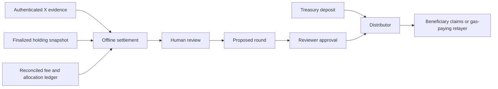

# Architecture and trust boundaries



The repository contains the offline settlement generator and distributor. The collectors, authoritative ledger, review UI, hosted proof service and production relayer are integration work, not implemented services here.

## Contract state machine

```text
None → Proposed → Active
          ↓         ↓
       Cancelled   Individual claims
          ↓
       Proposed (new revision)
```

Proposals do not reserve funds. Approval atomically reserves the full budget after checking the exact commitment and available funding. Active roots never change. Cancellation only applies to proposals. Pausing stops deposits, proposals, approvals and claims; administrative recovery of settings remains possible. Pausing neither erases claims nor changes entitlements.

The owner can resume or maintain an indefinite pause. Ownership is transferred in two steps; renunciation is disabled. Treasury and reward token are immutable. The contract has no upgrade, arbitrary execution, withdrawal or expiry interface.

## Accounting

```text
totalFunded = totalPaid + totalReserved + availableFunding
token balance >= totalFunded - totalPaid
round.paid <= round.budget
```

Only explicit treasury deposits create credit. Unsolicited direct transfers do not become fees or budget and have no recovery path. A deposit must debit and credit exactly the requested amount. Claims also require exact sender/recipient balance changes; taxed and rebasing tokens are unsupported.

Claims update accounting before transferring tokens and use a reentrancy guard. Every claim is independent: a recipient blocked by the token does not prevent another transaction from paying somebody else.

## Merkle allocation

OpenZeppelin StandardMerkleTree double-hashes ABI-encoded leaves:

```text
keccak256(bytes.concat(keccak256(abi.encode(
  chainId, distributor, rewardToken, roundId, beneficiary, amount
))))
```

Pairs are sorted by the tree library. Domain separation prevents reusing a proof on another chain, distributor, token or round. The claimed flag is keyed by round and beneficiary, not the executor. Anyone may submit a proof, but cannot redirect its payment.

The review commitment hashes chain ID, distributor, reward token, round ID, root, manifest hash, budget and revision with `abi.encode`. Revision changes invalidate previously prepared approval calldata, even if the other values were restored.

## Design decisions

| Decision | Reason | Tradeoff |
| --- | --- | --- |
| Individual Merkle claims | Bounded transaction size; independently retryable payments; manual fallback | Proof distribution and root correctness become operational dependencies |
| Prefunded budgets | No promise of rewards against unreceived revenue; liabilities remain backed | Treasury must explicitly fund rounds |
| Separate reviewer and proposer | Automation cannot activate a round using its proposer permission | Addresses can still belong to one human; key custody matters |
| Immutable active allocation | Prevent after-the-fact changes to approved rewards | Incorrect roots may permanently strand funds |
| No proxy or withdrawal | Smaller authority surface and stable entitlements | No in-place upgrade or recovery of unsupported direct deposits |
| Historical holding snapshot | Same eligibility point for all participants | Does not prove continuous holding or prevent all Sybil behavior |

## Trust boundaries

The contract cannot verify X authenticity, organic engagement, holder identity, Pons provenance, Merkle leaf sum or fairness. An administrator can approve a bad allocation. A valid proof authenticates what was approved, not whether it was deserved. Static analysis and coverage do not change that boundary.
